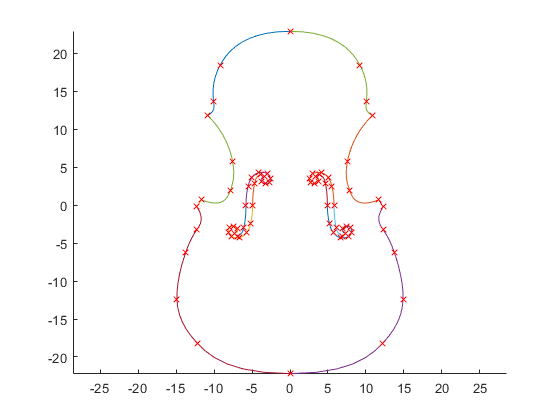
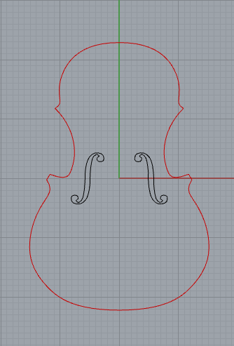

# Violin_Boundary
The repository contains the NURBS boundary curve of a violin with an F-hole presented in the works of Jeremias Arf and Mathias Reichle on SB-IGA.

The NURBS curves are made available either as a Matlab file in the frame of GeoPDEs or as a Rhino file. The Rhino files are split into the full violin or half of the violin due to symmetry.(*)

If you use this data, please cite one of the following references according to the features you used:

[1] J. Arf, M. Reichle, S. Klinkel, B. Simeon. Scaled boundary isogeometric analysis with C^1 coupling for Kirchhoff plate theory, Comput. Methods Appl. Mech. Eng., 415:116198, 2023. DOI:10.1016/j.cma.2023.116198

[2] M. Reichle, J. Arf, B. Simeon, S. Klinkel. Smooth multi-patch scaled boundary isogeometric analysis for Kirchhoff-Love shells, Meccanica, 2023. DOI:10.1007/s11012-023-01692-z.

(*) We recommend using the software Matlab 2022a or Rhino 7, respectively. Further, the GeoPDEs files can be obtained from: http://rafavzqz.github.io/geopdes/.

## Content
OrigCurve.m - Matlab file that provides the NURBS boundary in the workspace after running the code.

Viola_Boundary.3dm - 3D Rhino model of the NURBS boundary curves.

| Matlab Curves | Rhino Curves |
| :---: | :---: |
| |  |

## Acknowledgments

The financial support of the DFG (German Research Foundation) under Grant No. KL1345/10-2 (project number: 667493) and Grant No. SI756/5-2 (project number: 667494) is gratefully acknowledged.
